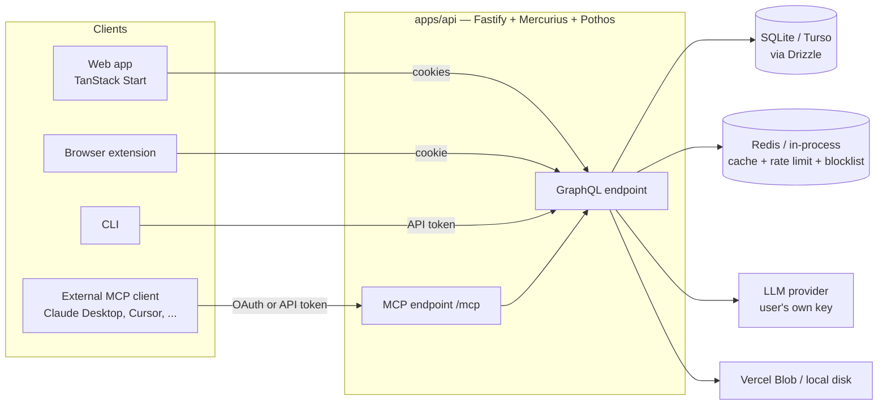

# Trakwyn — Design & Architecture

This document describes how Trakwyn is put together: the shape of the monorepo, the layering inside the API, how the web app is structured, and the conventions that hold both together. It's a companion to [README.md](./README.md) (what the product does and how to run it) and [CLAUDE.md](./CLAUDE.md) (the terse, exhaustive reference used by coding agents) — this is the narrative version, for a human getting oriented.

## Contents

- [System overview](#system-overview)
- [Monorepo layout](#monorepo-layout)
- [API architecture](#api-architecture)
- [Web architecture](#web-architecture)
- [Cross-cutting conventions](#cross-cutting-conventions)
- [Testing strategy](#testing-strategy)
- [Deployment](#deployment)

## System overview

Trakwyn is a job-application tracker: applications move through a pipeline (draft → applied → interviewing → offer/rejected), with notes, documents, contacts, interview rounds and offers attached to each one. AI features (job-description parsing, cover-letter drafting, resume matching, a chat assistant) are bring-your-own-key — Trakwyn never runs them on a shared account. An MCP server exposes the same data to external AI clients, read-only by default.



## Monorepo layout

Turborepo + pnpm workspaces, three packages:

| Package        | Path             | What it is                                                                         |
| -------------- | ---------------- | ---------------------------------------------------------------------------------- |
| `@trakwyn/api` | `apps/api`       | Fastify + Mercurius + Pothos GraphQL server, Clean Architecture layering           |
| `@trakwyn/web` | `apps/web`       | TanStack Start (SSR React) frontend                                                |
| `@trakwyn/ui`  | `packages/ui`    | Shared component library consumed by `apps/web` (and synced into claude.ai/design) |
| —              | `apps/extension` | Browser extension that clips job postings and reads the shared auth cookie         |
| —              | `apps/cli`       | `tw` — a terminal client authenticating the same way as everything else            |

`packages/shared` exists for cross-app constants/utilities but is currently minimal — API types flow to the web app through GraphQL codegen instead of a shared TS package.

Turborepo tasks (`turbo.json`) cache `build`/`typecheck`/`test`/`lint` and treat `dev`/`db:*`/`codegen` as uncached/sequential. `pnpm dev` at the root runs both apps concurrently; each app also has its own scoped scripts (`pnpm --filter @trakwyn/api test`, etc).

## API architecture

`apps/api/src` is layered Clean Architecture, strictly inward-only:

```
domain/              Pure entities — no framework imports, no Drizzle
use-cases/           Business logic + port interfaces (IApplicationRepository, IStorageProvider, ...)
  ports/
interface-adapters/
  resolvers/         GraphQL resolvers — call use cases via the DI container
  mappers/           Drizzle row ↔ domain entity
  mcp/               MCP protocol controller
  llm/               Tool catalogue, provider adapters
infrastructure/
  db/                Drizzle client, schema.ts, repository implementations
  cache/             MemoryCache / RedisCache (+ InstrumentedCache decorator)
  storage/           LocalStorageProvider / VercelBlobStorageProvider
  observability/     OTel tracing + metrics
http/
  schema/            Pothos schema builder — types, queries, mutations
  plugins/           Fastify plugins (auth, CORS)
  routes/            GraphQL + MCP + MCP-OAuth HTTP routes
  di/                Awilix registration modules, split by layer/domain
  container.ts       Thin re-export of the built container
  context.ts         Per-request GraphQL context (user, DI scope, request, reply)
```

**The dependency rule is enforced by a test, not just convention.** `__tests__/architecture/dependencyRule.test.ts` fails the build if `domain/` reaches outward, if `use-cases/` imports from `interface-adapters/`, `infrastructure/`, or `http/`, or if a framework import (Drizzle, Fastify, GraphQL, Pothos, libsql, web-push) shows up inside `domain/` or `use-cases/`. A short, ticket-tagged exemption list covers pre-existing violations, and the test fails if an exempted entry stops violating — so a fix can't quietly leave its exemption behind.

### Dependency injection

Awilix (`@fastify/awilix`), with repositories and resolvers registered `SINGLETON` and use cases `TRANSIENT`. `http/di/index.ts`'s `buildContainer()` composes typed registration modules (`http/di/*.ts` for infrastructure/repositories/rate-limiters/mappers/resolvers, `http/di/use-cases/*.ts` one file per domain) into the `Cradle` interface (`http/di/types.ts`). `container.ts` just re-exports it.

### Errors

Use cases throw `DomainError` subclasses (`use-cases/errors/DomainError.ts`) — `NotFoundError`, `ForbiddenError`, `ConflictError`, `UnauthorizedError`, `ValidationError`, `RateLimitedError`, `StepUpRequiredError`, and a few domain-specific ones. They carry a `code`, not an HTTP status — `http/errors/formatError.ts`'s `fromCodedError` is the one place that maps `code` → status, at the HTTP boundary. This keeps `use-cases/` ignorant of HTTP entirely (enforced by the same dependency-rule test), and means a new error subclass needs a matching `fromCodedError` case or it silently degrades to a 500. A bare `throw new Error(...)` from a use case is a bug for the same reason — it has no `code` to map.

### Auth

Every client authenticates via the same HttpOnly cookies (`trakwyn_access_token`, `trakwyn_refresh_token`), set by `setAuthCookies()` at every auth entry point (login, register, refresh, OAuth callback, TOTP, logout, delete-account). The web app relies on the cookie alone (`credentials: 'include'`, no token kept in JS memory); the browser extension reads the same cookie directly via `chrome.cookies.get()` since it shares the API's domain. `buildGraphQLContext.ts` still accepts an `Authorization: Bearer <token>` header as a fallback, for non-cookie clients (API tokens, the CLI).

A third, non-HttpOnly `trakwyn_logged_in` hint cookie lets the web app answer "is anyone logged in?" client-side with a synchronous `document.cookie` read, since it can never read the real (HttpOnly) tokens — it's a display hint only (used to redirect off `/login`, swap "Sign in" for "Go to dashboard"), never the actual authorization check, which the API still performs on every request regardless of what the hint says.

**Session revocation.** Access-token verification is otherwise stateless (signature + expiry only), so a revoked session's already-issued token would keep working until it expires on its own. Every revocation path (explicit revoke, revoke-others, password reset, refresh-token-reuse detection) also writes the session id to a blocklist that's checked on every request, via `BlocklistingSessionRepository` — a decorator over the real session repository, so no call site has to remember to do it. Backed by Redis in prod, an in-process map in dev. It **fails open**: a blocklist-store error resolves to "not revoked" rather than locking everyone out — a Redis outage degrades to the old up-to-15-minute revocation delay, not a full outage.

### MCP server

`POST /mcp` is a read-mostly [Model Context Protocol](https://modelcontextprotocol.io) server — JSON-RPC 2.0, protocol `2024-11-05`. The route (`http/routes/mcp.routes.ts`) owns only transport and auth; all protocol logic lives in `interface-adapters/mcp/McpController.ts`.

Two ways in:

- **OAuth** (recommended) — dynamic client registration, authorization-code + PKCE (`S256`), a consent screen scoped to `read` or `full`, grant-wide revocation (`POST /oauth/revoke` invalidates every credential a consent ever issued, not just the token presented). See [docs/mcp-oauth.md](docs/mcp-oauth.md).
- **API tokens** — a `trakwyn_...` token created in Settings → Integrations, for scripts and clients that don't support OAuth.

Auth for MCP is deliberately different from GraphQL's: it accepts tokens/grants of **either** scope and rejects JWTs outright, whereas the GraphQL auth path requires `full` — so a `read`-scoped credential reaches MCP and nothing else. Every tool carries an internal `access: 'read' | 'write'` tag (stripped before going over the wire): `tools/list` hides write tools from a read-scoped caller, `tools/call` refuses them outright — the refusal is the real security boundary, the hiding is a UX convenience for the model. **Nothing deletes** — there are no delete tools in the catalogue at all.

The tool catalogue (`interface-adapters/llm/toolCatalogue.ts`) is a presentation contract — names, descriptions, JSON Schema — so it lives with the other outward-facing schemas, not in `use-cases/`. The chat assistant's tool list is built from the same catalogue, filtered to reads only (chat is session-authenticated, with no scope to gate on); which surface exposes which tools is a composition decision made in `http/di`, not in the catalogue itself.

### Storage, email, cache

All three are provider-swappable behind a port interface, selected by an env var, so dev needs no external service:

| Concern                                | Port                                          | Dev implementation                     | Prod implementation         |
| -------------------------------------- | --------------------------------------------- | -------------------------------------- | --------------------------- |
| Storage                                | `IStorageProvider`                            | `LocalStorageProvider` (disk)          | `VercelBlobStorageProvider` |
| Email                                  | (email service)                               | `ConsoleEmailService` (logs the email) | `BrevoEmailService`         |
| Cache / rate limit / session blocklist | `ICache` / rate limiter / `ISessionBlocklist` | in-process map                         | `RedisCache` (Upstash)      |

The document-upload flow (`requestUploadUrl` → client uploads directly to storage → `confirmDocument`) differs slightly by provider: Vercel Blob hands back a client token used with `@vercel/blob/client`'s `put()`; local storage hands back a URL under `/uploads/_upload/*` that the web app `PUT`s to directly.

### Database

Drizzle ORM over `@libsql/client` — a local SQLite file in dev, Turso in prod (same client either way, so `drizzle-kit migrate` can apply directly to a remote Turso URL). Schema: `User → JobApplication → [Note, Document, ...]`.

**Deletes are hard, with one exception.** `JobApplication.deletedAt` is the only soft-delete — deleting an application moves it to Trash, purged 30 days later by a nightly job. The filter lives in the repository (`DrizzleApplicationRepository`), not scattered across use cases, so lists, search, analytics, MCP tools, and scheduled digests are all covered by construction. Everywhere else, a foreign key's `onDelete` action is the retention policy — 31 of 33 cascade; every key is required to appear in a test (`onDeleteBehaviour.test.ts`) that fails on an unlisted one, so adding a table forces a deliberate choice instead of copy-pasting the row above it.

libsql doesn't enforce foreign keys by default; `PRAGMA foreign_keys = ON` is set explicitly at client construction (both the real client and the test DB helper) — without it, `ON DELETE CASCADE` silently no-ops.

### Observability

Traces, logs, and metrics ship to Axiom via OTel. Two things are actually measured: cache hit/miss (via an `InstrumentedCache` decorator at the `ICache` boundary, so `MemoryCache` and `RedisCache` are directly comparable), and Redis fail-open events / circuit-breaker transitions across the three subsystems that degrade silently by design (cache, rate limiter, session blocklist) — without a counter, an outage there looks identical to normal operation from the outside.

## Web architecture

`apps/web` is TanStack Start (SSR-capable React) with file-based routing under `src/routes/`.

### Route shape

```
/                          marketing (SSR + prerendered)
/features, /features/*     marketing (SSR + prerendered)
/privacy, /terms,
  /accessibility            marketing (SSR + prerendered)
/login, /register           public, client-only (ssr: false — a cookie check gates them)
/_authenticated/*           protected layout; beforeLoad redirects unauthenticated visitors to /login
  /dashboard
  /applications/*
  /settings/*
  /assistant/*
```

**Marketing pages SSR unconditionally and are prerendered at build time** — enforced by `__tests__/routes/marketingSsr.test.ts`, which is exhaustive over every file in `src/routes/`: a new top-level route file must be classified as either a prerendered marketing page (added to `vite.config.ts`'s nitro `routeRules` and the test's own list) or an exempted client-only/token page, or the test fails. This matters because the prerendered HTML is what search engines and link-preview crawlers actually see — a marketing page that quietly gained an auth gate or a client-only cookie check would otherwise still "work" for a logged-in visitor while serving an empty shell to everyone else.

### Data fetching

`graphql-request` (`gqlClient`, `src/graphql/client.ts`) plus TanStack Query. The client intercepts an `UNAUTHORIZED` GraphQL error, attempts a silent token refresh, retries once, and redirects to `/login` only if that also fails. Types are generated by `graphql-codegen` into `src/graphql/generated/` from `.graphql` files + the live API schema — never hand-edited, regenerated with `pnpm codegen` (API must be running).

### Styling & the shared UI package

Tailwind CSS v4, via `@tailwindcss/vite` — no design-token layer, no CSS-in-JS; every surface (including `packages/ui`) is styled with directly-authored Tailwind utility classes on the stock color/spacing scale. Dark mode is a `.dark` class toggle (`@custom-variant dark`), not `prefers-color-scheme` — a component needs an ancestor with `.dark` to pick up any `dark:` utility. `packages/ui` ships plain functional components with no context/provider requirement; the web app's `route-transition` animation and sidebar-entrance keyframes live in `apps/web/src/styles.css` directly.

### Internationalization

i18next + `react-i18next`, five locales (`en`, `en-GB`, `zh-HK`, `zh-TW`, `zh-CN`). Only English is bundled synchronously (it's the `fallbackLng`, so it must be available before any render); the other four are fetched on demand as separate chunks the first time a locale is selected, falling back to English strings for the one tick before the chunk lands. An ESLint rule (`i18next/no-literal-string`, currently a `warn`) flags hardcoded JSX text — enforced as a hard requirement for marketing-page copy and settings/nav/auth surfaces (`t()` throughout, no literals), a soft nudge everywhere else pending a wider sweep.

### The `_authenticated` shell

A single layout route wraps every protected page: a fixed sidebar (main nav + a settings entry point + account menu), a bottom nav on mobile, a command palette, and a persistent chat-assistant dock. `beforeLoad` on `_authenticated` is what actually gates access — the client-only hint-cookie check on marketing pages is a _display_ optimization, not the security boundary.

## Cross-cutting conventions

- **IDs are `nanoid()` strings**, never auto-increment integers, everywhere in the schema.
- **Domain entities are plain objects/classes** with zero Drizzle or framework imports; mappers are the only thing that knows how a Drizzle row becomes one.
- **Adding a feature follows one layer order**: domain entity → port interface → use case → Drizzle repository → Pothos type/resolver → GraphQL operation → DI registration → `.graphql` file in web → codegen → UI. Skipping a step usually means hitting the dependency-rule test or a missing DI registration.
- **Linear issue lifecycle**: an issue moves to _In Progress_ before implementation starts, _In Review_ once a PR is open, _Done_ only once merged (or on explicit request). Branches are `<type>/<jef-id>-<brief>` (ticket segment omitted when there isn't one), always in a worktree under `.claude/worktrees/`.
- **Tests ship in the same PR as the behavior**, mirroring the convention for that layer — this isn't a style preference, it's treated as part of "done."

## Testing strategy

| Layer                       | Tool / pattern                                                                             |
| --------------------------- | ------------------------------------------------------------------------------------------ |
| API use cases               | Vitest + repository mocks (`__tests__/helpers/mocks.ts`)                                   |
| API repositories            | Vitest + `createTestDb()` — a real in-memory SQLite DB per test, no mocks                  |
| API resolvers               | Vitest, mocked use-case dependencies (`__tests__/interface-adapters/resolvers/`)           |
| API architecture invariants | Vitest — dependency rule, `onDelete` coverage, domain-error shape                          |
| Web components/pages        | Vitest + Testing Library, `gqlClient`/router mocked (`apps/web/src/__tests__/components/`) |
| Web SSR/prerender invariant | Vitest — exhaustive classification of every route file                                     |
| E2E                         | Playwright (`pnpm test:e2e`)                                                               |

## Deployment

Vercel, both apps as separate projects on subdomains of one purchased domain (`www.trakwyn.com` / `api.trakwyn.com`) — same registrable domain, so cookies scoped with a leading-dot `COOKIE_DOMAIN` reach both, and the browser treats them as same-site even with `SameSite=None` set (harmless there, and it sidesteps depending on same-site classification at all).

**Marketing pages are prerendered into static HTML** at build time (nitro's `routeRules`, `preset: 'vercel'`) so the serverless function is never invoked for them — Vercel's routing puts `handle: filesystem` ahead of the server fallback. Before this, every anonymous visit paid a cold cross-region hop; now only truly dynamic routes do.

Required env vars beyond the obvious (`DATABASE_URL`/`DATABASE_AUTH_TOKEN`, `JWT_SECRET`/`JWT_REFRESH_SECRET`): `API_ORIGIN` (what the MCP OAuth discovery documents advertise as the issuer — falls back to the request's `Host` header, which a caller controls, if unset), `COOKIE_DOMAIN` (leading dot; without it cookies default host-only and the `trakwyn_logged_in` hint cookie becomes invisible across subdomains), `CORS_ORIGIN` (must exactly match the web app's deployed origin or credentialed requests are silently rejected), `STORAGE_PROVIDER` / `CACHE_PROVIDER` / `EMAIL_PROVIDER` (provider toggles, default to the "needs external service" option in prod).
