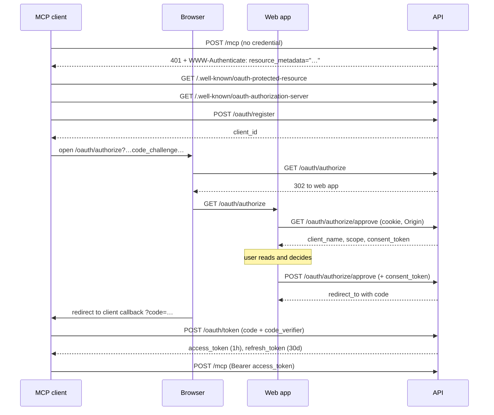

# MCP OAuth

How an MCP client gets a credential for `POST /mcp`, and why each step is
shaped the way it is.

Three parties are involved:

|                                 |                                                                                                                                                  |
| ------------------------------- | ------------------------------------------------------------------------------------------------------------------------------------------------ |
| **MCP client**                  | Claude Desktop, MCP Inspector, anything speaking the protocol. A _public_ client — it holds no secret, so PKCE is what binds the exchange to it. |
| **API** (`api.trakwyn.com`)     | Both the authorization server and the resource server.                                                                                           |
| **Web app** (`www.trakwyn.com`) | Renders the consent screen. Nothing else.                                                                                                        |

The API and the web app being separate origins is the detail that shapes most
of the consent step below.

An alternative exists for anything that does not want to implement OAuth:
manually-created API tokens (`trakwyn_…`) still work on `/mcp`, and a read-only
one is the simplest way to hand a client limited access.

## The flow end to end



## 0. Discovery

A client that has no credential starts by being told where to get one. `/mcp`
answers an unauthenticated request with a pointer rather than a bare 401:

```
WWW-Authenticate: Bearer resource_metadata="https://api.trakwyn.com/.well-known/oauth-protected-resource"
```

From there:

- `GET /.well-known/oauth-protected-resource` → which authorization server
  guards this resource, and that scopes are `read` | `full`.
- `GET /.well-known/oauth-authorization-server` → every endpoint URL, plus the
  hard limits: `response_types_supported: ["code"]` and
  `code_challenge_methods_supported: ["S256"]`. There is no implicit grant and
  no `plain` PKCE.

Both documents are built from the **`API_ORIGIN`** environment variable, not
from the request's `Host` header. They name the endpoints a client will send
credentials to, so a caller-chosen host would be a caller-chosen destination.
`API_ORIGIN` is therefore a deploy prerequisite; unset, it falls back to the
request origin, which is fine locally and wrong in production.

## 1. Registration

`POST /oauth/register` with `client_name` and `redirect_uris`. Unauthenticated
by design — that is what Dynamic Client Registration is — and rate-limited to
10 per 15 minutes per IP.

Redirect URIs must be **exact** URLs, HTTPS, or `http://` on loopback
(`localhost`, `127.0.0.1`, `[::1]`) for local clients. No wildcards, no prefix
matching, no path-relative comparison. Every later "is this URI registered?"
check is an exact-string membership test, which is only meaningful because
registration is this strict.

The response includes `client_id` (`trakwyn_mcp_client_…`) and
`token_endpoint_auth_method: "none"`.

## 2. Authorization request

The client generates a `code_verifier`, hashes it into a `code_challenge`, and
opens the user's browser at:

```
GET /oauth/authorize
      ?client_id=…
      &redirect_uri=…
      &response_type=code
      &scope=read|full
      &code_challenge=…
      &code_challenge_method=S256
      &state=…
```

The API validates this and **renders nothing**. It redirects to the web app's
own `/oauth/authorize` carrying the same parameters. The consent UI lives with
the rest of the product's UI; the authorization server stays an API.

Error reporting here is deliberately two-tiered:

- **Before** the client and its redirect URI are confirmed — missing
  parameters, unknown client, unregistered redirect URI — errors render inline
  as JSON. Reporting to an unverified `redirect_uri` would make this endpoint
  an open redirect (RFC 6749 §4.1.2.1).
- **After** they are confirmed, recoverable errors (`unsupported_response_type`,
  `invalid_scope`, a missing or non-`S256` challenge) redirect back to the
  client with `error=`, which is what a client can actually act on.

There is no login check at this step. The web app handles that, because it is
the party that can show a sign-in page.

## 3. Consent

The web page cannot read the session tokens — they are HttpOnly — so it calls
back into the API twice, with `credentials: 'include'`.

### `GET /oauth/authorize/approve` — may I show this screen?

Returns `client_name`, `scope`, and a **`consent_token`**. Three gates first:

1. **`Origin` must exactly equal the web app's origin**, else 403.
2. **The session must be live**, resolved through `AuthenticateRequestUseCase`
   so the JEF-164 revocation blocklist is consulted — a session ended by
   logout, "sign out other sessions", a password reset, or refresh-token reuse
   cannot authorize anything. Else 401 `login_required`, and the page offers a
   sign-in link carrying `returnTo` back to this same request.
3. The authorization request must still validate.

### `POST /oauth/authorize/approve` — the decision

Same three gates, plus the `consent_token` must verify against
`(userId, clientId, redirectUri, scope, codeChallenge)`.

That last check is the important one. `approved: true` is a field in a JSON
body, and the session cookie is `SameSite=None` in production, so the browser
attaches it to cross-site requests — meaning without further defence, a page on
another origin could submit an approval on a signed-in user's behalf, and the
response body carries the authorization code.

Two things prevent it, and both are needed:

- The **exact `Origin` check** is the load-bearing half. It is deliberately not
  left to the global CORS policy, which intentionally allows every
  `*.vercel.app` and `chrome-extension://` origin with credentials — correct
  for the API at large, not correct for an endpoint whose response carries an
  authorization code.
- The **consent token** ties the decision to a screen someone actually saw. It
  is issued only by the `GET` half — the call that renders the client's name
  for a human to read — is bound to the exact authorization request, and
  expires after 10 minutes. A token obtained for one client cannot approve a
  grant for another.

On approval the API mints an authorization code (`trakwyn_mcp_code_…`, 5-minute
TTL, stored only as a SHA-256 hash) **and a `familyId` — the grant id.**
Everything downstream inherits it; see [The grant id](#the-grant-id).

The response is `{ redirect_to }` and the page navigates there, landing the
browser on the client's callback with `?code=…&state=…`. A denial takes the
same route with `error=access_denied`, so the client learns the outcome rather
than hanging.

## 4. Token exchange

`POST /oauth/token`, `grant_type=authorization_code`, with `code`, `client_id`,
`redirect_uri`, and `code_verifier`. Accepts JSON or form encoding. Checks run
in this order:

1. `code_verifier` is well-formed — 43–128 unreserved characters (RFC 7636
   §4.1). A malformed verifier is rejected before any lookup.
2. The client exists, is not revoked, and registered this exact `redirect_uri`.
3. The code is found by hash, and its stored `clientId` and `redirectUri` match
   what is presented. A URI the client registered but did not use for _this_
   code is still refused.
4. **Already consumed → the whole grant is revoked**, then refused. See below.
5. Not expired; method is `S256`; the verifier hashes to the stored challenge,
   compared with `timingSafeEqual`.
6. Consumption is `UPDATE … WHERE consumedAt IS NULL … RETURNING`, so two
   concurrent exchanges cannot both succeed. The loser is treated as a replay.

Step 4 is worth stating plainly: refusing a replayed code is not sufficient,
because the tokens the _first_ exchange produced may be the attacker's. The
grant is revoked instead (OAuth 2.1 §4.1.3), and a
`mcp_oauth_code_reuse_detected` security event is recorded.

Success returns an access token (`trakwyn_mcp_…`, **1 hour**) and a refresh
token (`trakwyn_mcp_refresh_…`, **30 days**), both stamped with the code's
`familyId`, under `Cache-Control: no-store` (RFC 6749 §5.1).

## 5. Using the token

`POST /mcp` with `Authorization: Bearer trakwyn_mcp_…`.

`AuthenticateMcpRequestUseCase` tests the OAuth prefix **first**:
`trakwyn_mcp_` extends `trakwyn_`, so checking the API-token prefix first would
route every OAuth token to the wrong validator. Validation is a hash lookup
plus audience (`/mcp`), not-revoked, and not-expired.

It returns `{ sub, scope }`, and the scope is the point. It lands in the same
field an API token's scope does, so a `read` grant sees write tools filtered
out of `tools/list` and refused at `tools/call`. **Consenting to `read` buys
exactly what a read-only API token buys** — no more, and the two scope unions
are assigned across each other so any future divergence is a compile error
rather than a silent widening.

## 6. Refresh

`POST /oauth/token`, `grant_type=refresh_token`, with `refresh_token` and
`client_id`. Refresh tokens rotate: each use marks the presented token used
(again a conditional update) and issues a fresh pair in the same family.

If a token is presented that was **already used** — or if it loses the race to
be marked used — the family is _burned_: every refresh token **and every access
token** under that `familyId` is revoked, and a
`mcp_oauth_refresh_reuse_detected` event is recorded. Revoking only the refresh
side would leave whoever replayed the token a live access token for the
remainder of its hour.

## 7. Revocation

`POST /oauth/revoke` with `token`. Accepts **either** credential type — the
refresh prefix is tested first, since it is the longer of the two — and revokes
the entire family in both directions. RFC 7009 only _recommends_ that revoking
one kind takes the other with it; here it is unconditional, because the
user-visible meaning of revoking is "this client loses access", and leaving
either half alive does not deliver that.

It always answers `200` whether or not the token existed, so it cannot be used
to probe which credentials are real.

> **Known gap:** this endpoint is for the _client_ to call. A user has no way
> to see or revoke their own grants — no settings screen, no mutation. A
> malicious or abandoned client will not revoke itself, and the rotating
> 30-day refresh token renews indefinitely. Tracked as JEF-179.

## The grant id

`familyId` is the spine of the whole design. It is minted **once**, with the
user's consent, on the authorization code — and inherited by every access token
and refresh token descended from it.

That gives one property worth the indirection: **one consent is one revocable
unit.** Every way a grant can end reaches every credential under it —

- explicit revocation, from either token type
- authorization-code replay
- refresh-token reuse

— without any call site having to remember to clean up the other half.

It is also what makes a future "connected clients" settings screen
straightforward: group by `familyId`, revoke by `familyId`.

## Reference

### Endpoints

| Method | Path                                      | Purpose                                         |
| ------ | ----------------------------------------- | ----------------------------------------------- |
| `GET`  | `/.well-known/oauth-protected-resource`   | Which authorization server guards `/mcp`        |
| `GET`  | `/.well-known/oauth-authorization-server` | Endpoint URLs and supported parameters          |
| `POST` | `/oauth/register`                         | Dynamic client registration                     |
| `GET`  | `/oauth/authorize`                        | Validates, then redirects to the consent screen |
| `GET`  | `/oauth/authorize/approve`                | Consent screen data + consent token             |
| `POST` | `/oauth/authorize/approve`                | The consent decision                            |
| `POST` | `/oauth/token`                            | `authorization_code` and `refresh_token` grants |
| `POST` | `/oauth/revoke`                           | Grant-wide revocation                           |

### Lifetimes and prefixes

| Credential         | Prefix                 | TTL               |
| ------------------ | ---------------------- | ----------------- |
| Client id          | `trakwyn_mcp_client_`  | —                 |
| Authorization code | `trakwyn_mcp_code_`    | 5 minutes         |
| Consent token      | _(signed, not stored)_ | 10 minutes        |
| Access token       | `trakwyn_mcp_`         | 1 hour            |
| Refresh token      | `trakwyn_mcp_refresh_` | 30 days, rotating |

Every _secret_ is stored as a SHA-256 hash — codes, access tokens, refresh
tokens — so the raw values exist only in transit. The client id is the
exception, and deliberately so: it is a public identifier, not a credential,
and is stored as-is.

Prefixes are load-bearing, not cosmetic — they route a presented
credential to the right validator, so note that `trakwyn_mcp_refresh_` extends
`trakwyn_mcp_`, which extends `trakwyn_`. Longest match first, always.

### Rate limits

Per client IP. All four return `429` with `{"error": "rate_limited"}`.

| Endpoint                                       | Limit         |
| ---------------------------------------------- | ------------- |
| `/oauth/register`                              | 10 per 15 min |
| `/oauth/authorize`, `/oauth/authorize/approve` | 20 per 5 min  |
| `/oauth/token`                                 | 20 per 5 min  |
| `/oauth/revoke`                                | 20 per 5 min  |

### Security events

Recorded against the user, visible in account security activity:
`mcp_oauth_authorized`, `mcp_oauth_token_issued`, `mcp_oauth_token_revoked`,
`mcp_oauth_refresh_reuse_detected`, `mcp_oauth_code_reuse_detected`.

### Configuration

| Variable      | Why                                                                                                                    |
| ------------- | ---------------------------------------------------------------------------------------------------------------------- |
| `API_ORIGIN`  | The issuer and endpoint URLs in the discovery documents. Unset, they fall back to the caller-controlled `Host` header. |
| `CORS_ORIGIN` | Its first entry is the web app origin — the exact value the consent endpoints require in `Origin`.                     |
| `JWT_SECRET`  | Signs consent tokens (shared with `OAuthStateService`).                                                                |

### Where the code lives

|                                                              |                                                                  |
| ------------------------------------------------------------ | ---------------------------------------------------------------- |
| `http/routes/mcpOAuth.routes.ts`                             | All eight endpoints; Origin, rate-limit, and consent-token gates |
| `use-cases/mcpOAuth/`                                        | Register, create code, exchange, rotate, validate, revoke        |
| `infrastructure/auth/McpOAuthConsentService.ts`              | Signs and verifies consent tokens                                |
| `infrastructure/db/repositories/DrizzleMcpOAuth*.ts`         | Atomic consume / mark-used / revoke-family                       |
| `apps/web/src/routes/oauth/-components/McpAuthorizePage.tsx` | The consent screen                                               |

## Deviations from the specs

Worth knowing before pointing a strict client at this:

- **No `resource` indicator (RFC 8707).** Access tokens carry an audience
  internally and are checked against it, but the parameter is not accepted or
  echoed.
- **Consent tokens are not single-use.** They expire after 10 minutes and are
  bound to the request; the `Origin` check is what stops cross-site
  submission, so replay by the legitimate browser is harmless.
- **`/mcp` is POST-only JSON-RPC** — no `GET`/SSE endpoint and no session
  handling, i.e. a subset of MCP's Streamable HTTP transport. `GET` and
  `DELETE` answer `405` with `Allow: POST`, so a client learns the endpoint is
  real but offers no stream rather than reading a `404` as "no server here".
- **No pruning** of expired codes or tokens yet, though `expiresAt` is indexed
  on all three tables.
